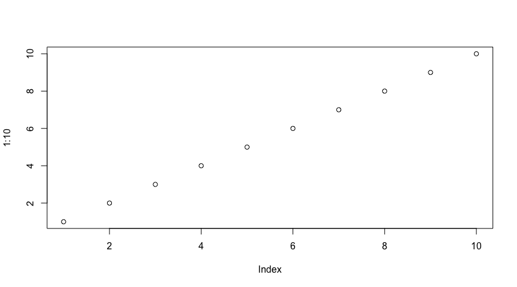

Report template title
================
Ben Fasoli

Revised: 2018-01-31

#### Text formatting

We can include markdown formatting for **bold**, *italic*, ***both***, [links](https://air.utah.edu), `code` and LaTex formatting for inline equations (such as styling subscripts for CO<sub>2</sub>).

#### Tables

We can create tables using hyphens `-` and pipes `\` such as

| Short          | Long           |
|----------------|----------------|
| CO<sub>2</sub> | Carbon Dioxide |
| CH<sub>4</sub> | Methane        |

#### Lists

Lists can be ordered automatically using numbers

1.  One
2.  Two
3.  Three

or bulleted

-   One
-   Two

and can have sub points with two spaces before the dash

-   One
-   a
-   b

#### Code

R code can be included inline using or in longer blocks such as

``` r
plot(1:10)
```



For code that we want rendered but not run (such as to syntax highlight another language), we omit the {} and specify the language such as

``` css
h1 {
  color: #000;
}
```
